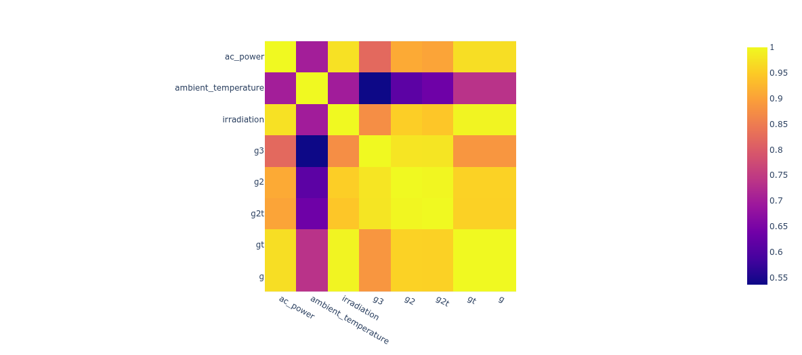

# [Project 1: Photovoltaic grid malfunction detector](https://github.com/luizfreire96/photovoltaic-grid-malfuncction-detector)

In this repository a exploratory analysis is made from solar energy production and ambient conditions data.  
Then a linear model is created to predict if the grid have a malfunction based in the error of the model.  
If the residual error is outside of the 95% confidence interval, probably is a unusual error that indicate malfunction in the grid or the instrumentation 
Flask is used to create the app and docker to create an environment with the dependencies to run the app. 
To access the application click [here](https://pv-malfunction-detector.herokuapp.com/) 

  

    <table>
	    <tr>
    	    <td style="padding:10px">
        	    
      	    </td>
            <td style="padding:10px">
            	
      	    </td>
        </tr>
    </table>

# [Project 2: Telecom churn predictor](https://github.com/luizfreire96/Telecom-Churn-analysis)

In this repository a end-to-end application was created to predict if a telecom company customer will churn.  
The data is unbalanced and some work has been done to get a better recall. 
Random Forest Classifier has been used to make this application 
The application was deployed in heroku using docker. Click [here](https://laff-churn-predictor.herokuapp.com/) to access the aplication 

    <table>
	    <tr>
    	    <td style="padding:10px">
        	    
      	    </td>
            <td style="padding:10px">
            	
            </td>
            <td style="padding:10px">
            	
            </td>
        </tr>
    </table>

# [Project 3: Wind Behaviour Prediction](https://github.com/luizfreire96/Wind-energy-data-curve-fit)

In this repository a wind speed prediction is made using probability density functions (PDF) and time series models. 
The data is grouped in bins of 0.1 and 0.05 m/s to fit the probability density function. 
The time series models used were the persistence model and auto ARMA, that autmaticaly find the best hyperparameters for that data. 
The PDFs used were the normal and weibull distributions. 
It seen the weibull mean value have the lowest RMSE error for long term prediction, but for prediction made up to 6 hours the best model can vary. 

 

    <table>
	    <tr>
    	    <td style="padding:10px">
        	    
      	    </td>
            <td style="padding:10px">
            	
      	    </td>
        </tr>
    </table>

# Tableau Visualizations
Click [here](https://public.tableau.com/app/profile/luiz.alberto.freire.filho4023) to access my tableau profile

# Minor Projects and Exercises
[Python](https://github.com/luizfreire96/br-python-challenges) 
[SQL](https://github.com/luizfreire96/SQL-Exercises) 
[Szeged-Weather-linear-regression](https://github.com/luizfreire96/Szeged-Weather-linear-regression) 
[Greenhouse-Gases-Influence-in-Temperature](https://github.com/luizfreire96/Greenhouse-Gases-Influence-in-Temperature) 
[Car-industry-70-82](https://github.com/luizfreire96/Car-industry-70-82) 
[Rent-web-scraping](https://github.com/luizfreire96/Rent-web-scraping)
